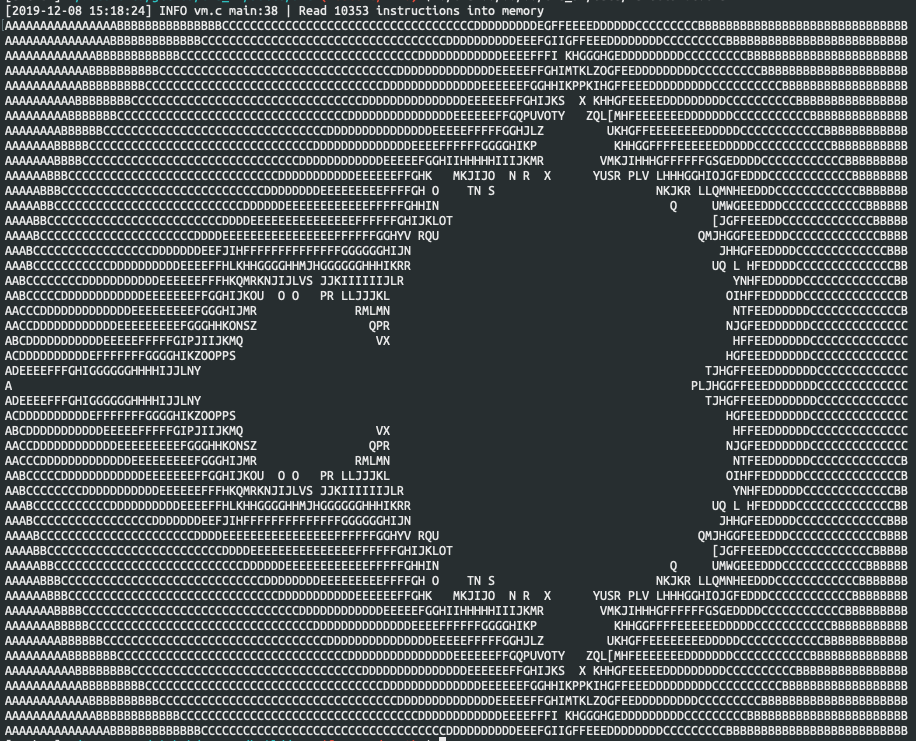

<p align="center">
  
</p>

# Un compilateur Brainfuck comme preuve de concept du projet Eva

Arthur Correnson <arthur.correnson@univ-tlse3.fr> & Nathan Graule <solarliner@gmail.com>

# Introduction

Brainfuck est un langage de programmation ésotérique désigné par **Urban **Müller**** en 1992. Les programmes brainfuck ne sont composés que des caractères **+**, **-**, **<**, **>**, **[**, **]**, **.** et **,**.

Voici un exemple du fameux "hello world" en bf :

```brainfuck
++++++++[>++++[>++>+++>+++>+<<<<-]>+>+>->>+[<]<-]>>.>---.+++++++..+++.>>.<-.<.+++.------.--------.>>+.>++.
```
Inutile donc de préciser que la syntaxe de ce langage est très peu adaptée à l'écriture de véritables programmes. En revanche, c'est un excellent joujou pour les curieux que nous sommes et il peut s'avérer très utiles dans certaines circonstances. Laissez-nous vous expliquez pourquoi...

## Un histoire de complétude ?

Lorsque l'on parle des langages de programmation, il est souvent question de la *Turing Completeness* (caractère Turing complet) de ces derniers.
Derrière cette expression un peu barbare se cache une idée simple : il s'agit de montrer qu'un langage de programmation est suffisamment riche pour pouvoir exprimer n'importe quel calcul. Nous ne rentrerons pas dans les détails formels qui se cachent derrière cette notion car il faudrait des centaines de lignes juste pour définir proprement le sujet (Des générations de chercheurs y travaillent encore, c'est dire !).

Maintenant que cette terminologie est introduite, pourquoi diable nous intéressons nous à ce sujet dans un article sur Brainfuck ? Eh bien figurez-vous que ce langage de programmation a le bon goût d'être complet au sens de Turing. Malgré son aspect très rudimentaire, il est théoriquement suffisamment riche pour exprimer à peu près ce que l'on veut (à condition que ce quelque chose puisse se calculer).

Or, il se trouve que prouver la complétude d'un langage de programmation peut être une tâche assez ardue. L'une des manières simples et de procéder par équivalence avec un langage dont on connaît déjà le caractère Turing Complet. Dans notre cas, nous voulions démontrer la complétude d'un langage d'assemblage en cours d'élaboration : le langage Eva. Pour se faire, nous avons implémenté un compilateur Brainfuck vers Eva.

## Un bref aperçu du langage EVA ...

Eva est un langage développé par l'association [CodeAnon](https://github.com/codeanonorg). Il s'agit d'un langage d'assemblage destiné à être utilisé pour programmer une machine virtuelle (du même nom). Il met à disposition du programmeur un jeu d'instruction très succinct et a pour objectif de servir de terrain de jeu pour l'apprentissage de la programmation en assembleur et l'écriture des compilateurs.

**Le jeu d'instruction d'Eva :**

+ `ADD/ADDC/SUB/SUBC` : opérations arithmétiques
+ `MOV` : chargement de valeur dans les registres
+ `LDR/STR` : opération sur la mémoire
+ `PUSH/POP` : opération sur la pile
+ `IN/OUT` : Entrées / Sorties
+ `CMP` : comparaison
+ `BEQ/BNEQ/BLE/BLT` : branchements conditionnels

## ... et du langage Brainfuck

Le langage Brainfuck est prévu pour s'exécuter sur une machine contenant des "cellules" de mémoire. On pourra également manipuler une tête de lecture écriture permettant de mettre à jour le contenu de ces cellules. Cette tête est appelée *data pointer*.

**Détails des commandes Brainfuck :**

+ `+` : Incrémente de 1 la valeur dans la cellule pointée par le *data pointer*
+ `-` : décrémente de 1 la valeur dans la cellule pointée par le *data pointer*
+ `>` : décale le *data pointer* d'une cellule vers la droite.
+ `<` : décale le *data pointer* d'une cellule vers la gauche.
+ `[` : début d'une boucle **while** qui s'arrête lorsque le *data pointer* pointe une cellule de valeur 0.
+ `]` : fin d'une boucle **while**.
+ `,` : saisie d'un caractère dans la cellule pointée par *data pointer*
+ `.` : affichage du caractère dans la cellule pointée par *data pointer*

Nous constatons déjà que les instructions de Eva ou de Brainfuck sont à peu près du même ordre de proximité avec la machine. On ne peut manipuler que des structures très simples : des unités de mémoire (cellules, registres), et des opérations arithmétiques élémentaires (addition, soustraction).

# Méthode

## Choix d'implémentation

Pour exécuter des programmes Brainfuck sur la machine virtuelle Eva, deux solutions s'offraient à nous. La première aurait été d'écrire une deuxième machine virtuelle en langage Eva et capable d'interpréter le langage brainfuck. Nous aurions donc fait tourner une machine virtuelle brainfuck dans une machine virtuelle Eva.

Une deuxième option étant d'écrire un compilateur capable de traduire le langage Brainfuck en langage Eva. Nous avons décidé de choisir cette alternative, un peu moins dépendante des éventuels défauts du langage Eva encore en cours de conception. Le compilateur est donc implémenté dans un troisième langage : [Rust](https://www.rust-lang.org/). Nous avons choisis le langage Rust pour plusieurs raisons. D'une part car il offre des outils performants et pratiques en matière d'écriture de tests, de débogage et de *benchmark*. Mais également parce que l'on trouve en Rust un compromis équilibré entre des concepts de programmation fonctionnels très appréciables lorsqu'il s'agit d'écrire un compilateur (filtrage de motifs, types inductifs..); mais aussi des concepts de plus bas niveaux comme la gestion manuelle de la mémoire par exemple. Enfin, c'est un outils moderne et cette expérience a été l'occasion de découvrir plus en détail ce langage qui fait parler de lui.

## Traduction des programmes

### Analyse syntaxique

La traduction à proprement parler des programmes brainfuck se décompose en plusieurs étapes. La première étape consiste à faire une analyse syntaxique. Au cours de cette étape, on extrait une représentation abstraite du programme sur laquelle le compilateur va pouvoir travailler. Cette étape nécessite d'abord de connaître la [grammaire formelle]() du langage afin d'identifier correctement les différents symboles qui compose un programme ainsi que leur agencement. Dans le cas de Brainfuck, la structure des programmes peut se définir informellement comme suit :

+ Un programme est une suite d'instructions
+ `+` `-` `>` `<` `.` `,` `[` `]` sont des symboles élémentaires
+ `+` `-` `>` `<` `.` `,` peuvent être interprétés comme des instructions
+ Une boucle est une instruction qui commence par le symbole `[`, termine par le symbol `]` et contient une suite d'instructions arbitraires (non vide).

La grammaire associée est la suivante :

```
Alphabet = {"+", "-", "<", ">", ".", ","}

# nommage des symboles élémentaires
Incr        -> "+"
Decr        -> "-"
Shift_left  -> "<"
Shift_right -> ">"
Input       -> ","
Output      -> "."
Loop_beg    -> "["
Loop_end    -> "]"

# règle de production d'une boucle
loop -> Loop_begin program Loop_end

# règle de production d'une instruction
# une instruction est soit un symbol élémentaire du langage
# soit une boucle while
instruction -> Incr
instruction -> Decr
instruction -> Shift_left
instruction -> Shift_right
instruction -> Input
instruction -> Output
instruction -> loop

# un programme peut se définir inductivement :
# Ou bien c'est une instruction seule,
# Ou c'est une instruction suivie d'un programme plus petit.
program -> instruction
program -> instruction program
```

**Remarque** : On a ici nommé les symboles élémentaires du langage Brainfuck pour garder une cohérence avec les [déclarations de types]() qui suivront.

Effectuons l'analyse syntaxique du programme suivant selon cette grammaire :

```brainfuck
+++[->+<]
```

```
program ( Incr, Incr, Incr, loop( Decr, Shift_right, Incr, Shift_left ) )
```

On pourra aussi remarquer que cette grammaire ne permet pas a priori de décrire des programmes brainfuck invalides :

```brainfuck
Programme invalide :
[++
```

En effet, ce programme ne satisfait aucune de nos règles de production.

En **Rust** la structure des programmes se traduit par la déclaration de type énuméré suivante :

```rust
// type pour les commandes brainfuck
pub enum Command {
	Inc,
	Dec,
	ShiftLeft,
	ShiftRight,
	Loop(Vec<Command>)
	Input,
	Output,
}

// alias pour le type "Program"
pub Program = Vec<Command>
```

On accompagnera cette définition de type d'un analyseur syntaxique construit à l'aider du module spécialisé [rust-peg](https://github.com/kevinmehall/rust-peg). Nous ne rentrerons pas dans les détails du code, mais les plus curieux pourront le consulter à directement [en ligne](https://github.com/eva-vm/eva_bf/blob/master/src/parse.rs).

### Génération de code Eva

Construire une représentation des programmes est une première étape. Cette étape terminée, il reste à générer le code Eva à partir de la représentation du programme Brainfuck. La génération du code se traduit par une fonction qui reçoit en entré la représentation abstraite du programme Brainfuck et donne en sortie un programme Eva sous forme de texte (ou d'un exécutable).

#### Brainfuck est la mémoire

Avant d'entamer les détails de l'implémentation d'une telle fonction, rappelons que le langage Brainfuck requiert l'usage d'un *data pointer* et d'un ensemble de cellules de mémoire. Il faut donc se poser la question de comment simuler ces deux éléments.

1. Nous fixons le *data pointer* comme étant la valeur contenue dans le registre n°0 de la machine Eva (R0)
2. La mémoire de la machine Eva est utilisée à la fois pour charger le programme, et comme zone de lecture/écriture pour les programmes brainfuck. Un mot mémoire de Eva a une taille de 32-bits, par soucis de simplicité, nous avons donc fixé la taille des cellules à 32 bits pour avoir une équivalence directe entre cellule mémoire au sens de brainfuck et mot mémoire au sens de Eva. Notons que les machines Brainfuck mettent généralement à disposition des cellules de 8 bits (juste assez pour contenir des caractères ASCII). Toutefois, la plupart des implémentations modernes de brainfuck donnent la possibilité d'augmenter la taille des cellules à 16, 32 et 64 bits.

Un premier problème se pose déjà. Si la mémoire de la machine Eva est à la fois le support de lecture/écriture et le support de stockage des programmes, il faut assurer qu'aucune opération de modification de la mémoire ne sera réalisée sur la région contenant le programme lui-même. Typiquement, il faudrait pouvoir éviter que l'instruction `+` ou `-` du langage Brainfuck ne soit exécutée alors que le *data pointer* pointe sur une case mémoire contenant le programme en train d'être exécuté.

Ce problème s'adresse en utilisant un *offset*. On compte le nombre de mots mémoire nécessaires au stockage du programme avant de le compiler, et on initialise le *data pointer* en conséquence. De plus les spécifications du langage Brainfuck impose deux contraintes sur le nombre de cellules :

1. Le nombre de cellules est au moins de 30k.
2. Le *data pointer* peut prendre des valeurs négatives.

La première contrainte est fixée pour garantir que la quantité de mémoire disponible est raisonnable. La deuxième est une spécificité de brainfuck qui permet de jouer avec les opérations `>` et `<`. Par exemple, si nous souhaitons écrire la valeur `1` dans deux cellules consécutives dés le début de l'exécution d'un programme, on peut écrire `<+>+` au lieu de `>+>+` : écrire à gauche de la cellule initiale est tout aussi correcte que d'écrire à sa droite. Notons que d'une implémentation à l'autre, ces contraintes peuvent varier. Pour rester compatible avec la majorité des programmes, nous avons décidé de satisfaire au mieux ces deux contraintes.

Pour garantir ces deux propriétés, on calcul donc l'*offset* suivant : `offset = nb_instructions + 15 000 - 1`.
Le code Eva généré par notre compilateur commencera alors toujours par l'en tête suivant :

```arm
	MOV R0, #n
```

où `#n` désigne l'*offset* auquel on ajoute 1 pour prendre en compte la première instruction `MOV` que l'on ajoute au programme. On peut donc simplifier le calcul de l'*offset* par la formule `offset = nb_instructions + 15 000`. Cette méthode de calcul d'*offset* peut se généraliser pour s'adapter aux caractéristiques de la machine virtuelle utilisée et au nombre de cellules souhaité. On peut également se poser la question de la vérification du *data pointer*, c'est à dire s'assurer que ce dernier ne prend pas pour valeur des adresses protégées. Ces questions sont traitées dans la partie [discussion](#Discussion).

#### Les instructions arithmétiques

Les opérateurs sur le *data pointer* `>` et `<` sont très simples à traduire, il s'agit d'opérations arithmétique sur le registre `R0` (qui par convention sert de *data pointer*).

```arm
	; >
	ADD R0, #1
	; <
	SUB R0, #1
```

Les instructions `+` et `-` de brainfuck sont sont à peine plus complexes, elles nécessitent de  modifier une valeur en mémoire en passant par un registre :

```arm
	; +
	; chargement de la valeur pointée
	LDR R1, [R0]
	; incrémentation
	ADD R1, #1
	; stockage de la valeur modifiée
	STR R1, [R0]

	; -
	; chargement de la valeur pointée
	LDR R1, [R0]
	; décrémentation
	SUB R1, #1
	; stockage de la valeur modifiée
	STR R1, [R0]
```

Notons que cette traduction est assez naïve et peuvent mener à des programmes très inefficaces. Par exemple, il n'est pas rares en brainfuck d'avoir de longues séquences d'instructions `+`, `-`, `>` ou `<`. Générer systématiquement une instruction Eva pour chacune de ces instructions Brainfuck mène à des codes très longs que l'on peut facilement optimiser. Par exemple, la séquence `++++++++` serait naïvement traduite comme une suite de 8 instructions `ADD R0, #1`. On peut remplacer cette suite d'instructions par `ADD R0, #8` et diviser ainsi drastiquement le nombre d'instructions Eva générées. On peut donc optimiser notre compilateur en détectant les plateaux de valeur `+` `-` `<` ou `>`.

#### Entrées et Sorties

Les opérations d'entrée/sortie sont traduisibles directement en Eva également. Rappelons que l'instruction `.` affiche le caractère ASCII stocké sous forme d'un entier dans la cellule pointée par *data pointer*. L'instruction `,` lit un octet et le place dans la cellule pointée par *data pointer*. Cela donne lieu aux traductions suivantes :

```arm
	; .
	OUT R0
	; ,
	IN R0
```

#### Boucles

Nous avons vu comment générer le code Eva pour les instructions arithmétiques et d'entrée/sortie du langage Brainfuck, il reste à traiter le cas des boucles. Ces dernières sont un peu plus subtiles à traduire. Le comportement d'une boucle en brainfuck est le suivant : Tant que le *data pointer* pointe sur une valeur différente de 0, le code de la boucle est exécuté, si le *data pointer* pointe sur 0, alors on sort de la boucle. Pour pouvoir décrire ce comportement, il faut donc deux choses indispensables : d'une part pouvoir localiser la première instruction du corps de la boucle, d'autre part pouvoir localiser la première instruction directement après la boucle. On utilise à cet effet les labels du langage Eva. On marque par un premier label le début de la boucle ainsi que la première instruction en sortie de boucle.

```brainfuck
avant [sequence] après
```

```arm
	; instructions pour "avant"

label_sequence:
	; instructions pour "sequence"

label_apres:
	; instructions pour après
```

Il faut ensuite assurer le bouclage sur les instructions du corps de la boucle. Cette opération se fait en deux temps dans le corps de la boucle. Dans un premier temps on vérifie la condition de boucle à l'aide de l'instruction de comparaison `CMP`. En fonction du résultat de la comparaison, on pourra éventuellement sortir de la boucle en utilisant un branchement conditionnel `BNEQ/BEQ`. On prendra également soin d'assurer un retour systématique au test de boucle une fois la séquence d'instructions de la boucle exécutée.

```arm
label_sequence:
	; on charge la valeur pointée par le data pointer dans un registre
	LDR R1, [R0]
	; on compare cette valeur à 0.
	CMP R0, #0
	; on charge l'adresse de l'instruction de début de sequence (première instruction dans le while)
	; dans un registre
	MOV R1, label_apres
	; si la valeur pointée est égale à 0, on sort de la boucle
	BEQ R1
	; sinon, on poursuit l'exécution des instructions dans l'ordre

	; corps de la boucle ...
	
	; cette comparaison donne toujours une égalité ...
	CMP R1, R1
	; ... on revient donc systématiquement au test de boucle une fois le corps de la boucle exécuté
	BEQ label_sequence
	

label_apres:
	...
```

# Résultats et discussion

Les résultats de cette expérience de compilation du langage Brainfuck sont intéressants. D'une part nous avons obtenu un compilateur capable de produire des exécutables pour la machine virtuelle Eva à partir d'un code Brainfuck. Quelques tests nous ont permis de vérifier la validité du compilateur.

<p align="center">
  
</p>

*Un exemple de l'exécution du programme `mandelbrot.bf` compilé pour Eva*


Si le compilateur donne un résultat fonctionnel, nous avons toutefois relever des performances assez désastreuses.


|  plateforme  |   Eva   | Copy.sh/brainfuck |
| :----------: | :-----: | :---------------: |
| mandelbrot.b | 57.77 s |       < 1s        |
|   hellom.b   |  < 1s   |       < 1s        |
|    yapi.b    |  < 1s   |       < 1s        |

*Tableau des temps d'exécution de différents programme brainfuck*

*Les sources peuvent être trouvées à l'adresse [https://copy.sh/brainfuck/?file=https://copy.sh/brainfuck/prog/hellom.bf](https://copy.sh/brainfuck/?file=https://copy.sh/brainfuck/prog/hellom.bf)*

Plusieurs facteurs semblent être à l'origine des lenteurs à l'exécution. Tout d'abord l'interpréteur de *bytecode* de la VM Eva est encore en chantier. Nous travaillons donc avec un support d'exécution encore à l'état expérimentale. Des modifications prochaines dans la conception du coeur de la VM Eva devrait accélérer l'exécution des programmes. D'autre part, le langage Brainfuck est un langage de très bas niveau dans le sens où ses opérations sont très élémentaires. Elles sont mêmes plus élémentaire que celles du langage Eva. Nous sommes donc dans un cas limite où notre compilateur traite un langage de bas niveau pour le compiler en un langage de plus haut niveau. Une instruction brainfuck simple est donc traduite en plusieurs instructions Eva chacune plus complexe. Une telle spécificité peut mener à des scénarios où le programme Eva résultant de la compilation nécessite beaucoup plus de traitement que d'interpréter instruction par instruction le programme brainfuck sur une machine dédiée (un interpréteur brainfuck). Enfin, chaque opération sur la mémoire en Brainfuck (`+` ou `-`) requiert un chargement de mémoire à registre et un stockage de registre à mémoire. Ces opérations d'accès mémoire à répétition sont coûteuses en temps. Un interpréteur pour Brainfuck se passe de cette distinction faites entre registres et mémoire et travaille sur un unique support représentant les cellules. On gagne ainsi en performances en interprétant directement les programmes brainfuck plutôt que que de les compiler dans un langage intermédiaire.


## Vers plus de généricité et de fiabilité ?

Dans la partie précédente, nous avons calculé des *offsets* afin d'éviter des écritures hasardeuses en mémoire. Le calcul d'*offset* présenté peut en fait se généraliser et ainsi s'appliquer à de nombreux contextes.

+ Soit `M` la taille en mot d'une instruction (dans le langage d'assemblage cible) en mémoire
+ Soit `N` le nombre de cellules que l'on souhaite mettre à disposition des programmeurs Brainfuck
+ Soit `I` le nombre d'instructions d'initialisations
+ Soit `T` le nombre d'instructions du code source brainfuck traduit en Eva.

Alors l'*offset* se calcul comme suit = `offset = M.(T+I) + N - 1`

On peut, en plus du calcul d'*offset*, ajouter un niveau de fiabilité en générant des instructions pour la vérification du *data pointer*. Le code Eva généré s'occupe alors de vérifier que la valeur du *data pointer* est valide à tout moment et ne pointe pas sur des régions de la mémoire protégées. On pourra alors interrompre l'exécution d'un programme en cas de violation d'une zone mémoire. Il existe plusieurs méthodes pour mettre en place une telle vérification, l'intégration d'un module dédiée à la gestion de la mémoire dans la machine Eva pourrait notamment simplifier le processus et augmenter significativement son niveau de fiabilité.

L'écriture de ce petit compilateur aura été une expérience tout à fait constructive. D'une part il nous a permis de valider la fécondité du projet sur le plan pédagogique puisque nous avons découvert beaucoup de nouveaux concepts en le réalisant. Nous avons également pu identifier les faiblesses de la machine virtuelle Eva notamment en terme de performances et de nécessité de se pencher sur un système de gestion de mémoire. Le développement de ce projet reste donc à suivre. Nous espérons publier un article prochainement pour parler plus en détails des avancés de Eva.

# Sources

+ [Brainfuck - Wikipédia](https://en.wikipedia.org/wiki/Brainfuck)
+ [Formal Grammar - Wikipédia](https://en.wikipedia.org/wiki/Formal_grammar)
+ [BF is Turing-Complete](http://www.iwriteiam.nl/Ha_bf_Turing.html)
+ [Brainfuck Specification](https://github.com/brain-lang/brainfuck/blob/master/brainfuck.md)